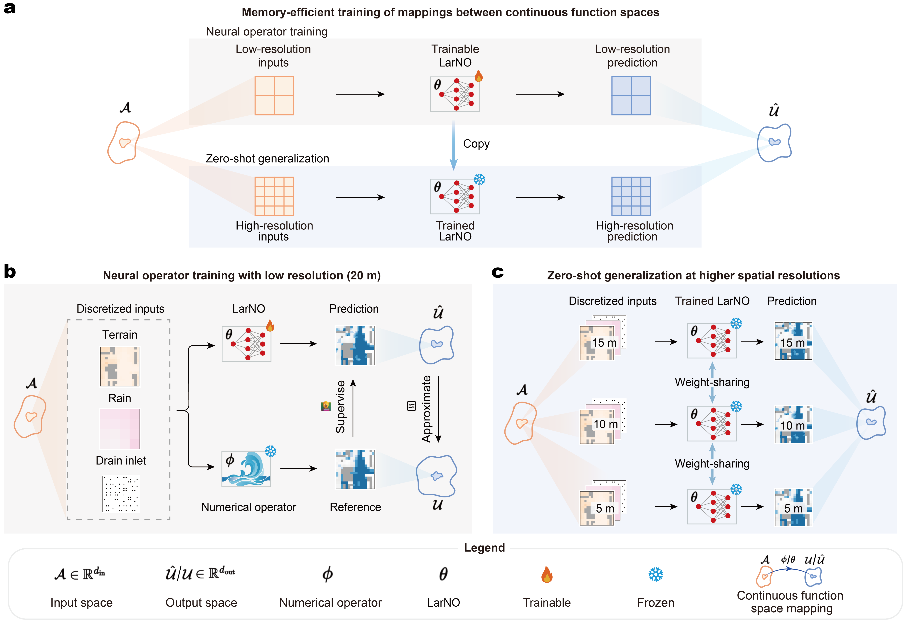
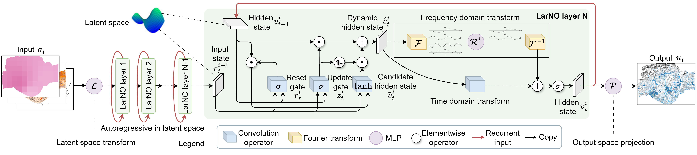

# Large-scale urban flood modeling and zero-shot high-resolution generalization with LarNO

---

## News
- **[02/03/2026]** Full end-to-end reproduction tutorial released — train and test LarNO with **a single GPU on [AutoDL](https://www.autodl.com/)**.
- **[02/03/2026]** Code and benchmark dataset publicly released.


> **[Journal of Hydrology]** &nbsp;|&nbsp;
> [Paper](#citation) &nbsp;|&nbsp;
> [Dataset](https://holmescao.github.io/datasets/LarNO) &nbsp;|&nbsp;
> [Pre-trained Weights (Google Drive)](https://drive.google.com/file/d/1ITPoTWQkm5v9kdZT9fqza2Xd4a6Lc-0t/view?usp=drive_link) &nbsp;|&nbsp;
> [Pre-trained Weights (Baidu Cloud, code: `LaNO`)](https://pan.baidu.com/s/1Iqz7UDoCYH0ioTyA-wrNeg?pwd=LaNO)

---

> 🚀 **New to deep learning or don't have a GPU?**
> You can train and test LarNO with **a single GPU** by renting one on [AutoDL](https://www.autodl.com/) for as little as ¥1–3/hour — no local hardware required.
> A full step-by-step guide using the browser-based JupyterLab is provided in [Section 13 — Cloud GPU: AutoDL Guide](#13-cloud-gpu--autodl-guide). No extra software installation needed.
>
> **Before you start:** download the dataset (see [Section 2 — Datasets](#2-datasets)) and pre-trained weights (see [Section 3 — Pre-trained Weights](#3-pre-trained-weights)) to your local machine first.

---

<p align="center">
  
  <br><em><strong>Memory-efficient neural operator training and zero-shot generalization to high resolutions for urban flood spatiotemporal forecasting.</strong>
    (a) Overview: a neural operator is trained at low resolution and applied zero-shot at higher resolutions by directly evaluating the learned continuous operator on finer grids.
    (b) Training stage: discretized inputs (rainfall, terrain, drain inlet) are fed to the neural operator, with outputs supervised by a numerical solver (MIKE Plus).
    (c) Zero-shot application of the trained operator at higher spatial resolutions without any retraining.</em>
</p>

<p align="center">
  
  <br><em><strong>LarNO architecture for urban flood spatiotemporal forecasting.</strong>
    The model comprises three stages: (1) a lifting layer maps the input to a higher-dimensional hidden state; (2) N LarNO layers iteratively update the hidden state — each layer first applies a GRU-based convolutional update combining the previous time-step and previous-layer hidden states, then refines the state via frequency-domain Fourier transforms (forward FFT, low-mode linear mixing, inverse FFT) and a local time-domain linear operator; (3) a projection layer maps the final hidden state to the output water depth.</em>
</p>


---

## Abstract

> *In urban areas, real-time early warning systems are used to mitigate the severe impacts of pluvial flooding. Although such systems have witnessed much recent development through the use of deep learning methods, urban-scale high-resolution modeling remains fundamentally constrained by the massive GPU memory demand for training neural networks. To overcome this bottleneck, we present LarNO, a memory-efficient, discretization-invariant neural operator that learns continuous-space hydrodynamic mappings to predict the spatiotemporal distributions of water depth based on dynamic rainfall and static topographic and drainage conditions. This approach enables zero-shot generalization to high resolution when trained solely on low-resolution data. Additionally, existing autoregressive neural operators compress complex dynamics into a single physical variable, leading to an information bottleneck in modeling complex nonlinear spatiotemporal dependencies. To resolve this, we embed spatiotemporal feature extractors into a neural operator to implement latent autoregression. Theoretically, we prove that our approach universally approximates continuous operators and enables zero-shot super-resolution generalization. An empirical case study of a highly urbanized region spanning nearly 100 km$^2$ in Shenzhen, China, subjected to observed rainfall events with spatiotemporal heterogeneity, demonstrates that LarNO achieves large-scale, high-resolution (5 m, 5 min), long-duration (6 h) urban flood real-time spatiotemporal forecasting to mm-level depth accuracy, reducing errors by more than half compared to state-of-the-art neural operators, while delivering two orders of magnitude faster inference speedup over a traditional hydrodynamic model. Besides, results from the ablation study validate the effectiveness of latent autoregression. Moreover, LarNO supports few-shot transfer to unseen catchments via fine-tuning. Furthermore, comprehensive parameter sensitivity analyses demonstrate the robustness and effectiveness of LarNO. Our work provides a groundbreaking framework for real-time early warning and refined management of large-scale urban flood events.*


---

## Table of Contents

1. [Installation](#1-installation)
2. [Datasets](#2-datasets)
3. [Pre-trained Weights](#3-pre-trained-weights)
4. [Choosing a Configuration](#4-choosing-a-configuration)
5. [Quick Test with Pre-trained Weights (region1)](#5-quick-test-with-pre-trained-weights-region1)
6. [Scenario A — Fine-tune on UKEA (Recommended)](#6-scenario-a--fine-tune-on-ukea-recommended)
7. [Scenario B — Train UKEA from Scratch](#7-scenario-b--train-ukea-from-scratch)
8. [Scenario C — Train Futian / Custom Dataset from Scratch](#8-scenario-c--train-futian--custom-dataset-from-scratch)
9. [Evaluation](#9-evaluation)
10. [Outputs and Metrics](#10-outputs-and-metrics)
11. [Configuration Reference](#11-configuration-reference)
12. [Project Structure](#12-project-structure)
13. [Cloud GPU — AutoDL Guide](#13-cloud-gpu--autodl-guide)
14. [License](#14-license)
15. [FAQ](#15-faq)
16. [Citation](#16-citation)

---

## 1. Installation

💻 **Step 1 — Clone the repository**

```bash
git clone https://github.com/holmescao/LarNO
cd LarNO
```

💻 **Step 2 — Create a conda environment**

```bash
conda create -n larno python=3.9
conda activate larno
```

💻 **Step 3 — Install PyTorch**

Install **PyTorch ≥ 2.1 with CUDA ≥ 11.8**. Select the command matching your CUDA driver version at:

👉 **[https://pytorch.org/get-started/locally/](https://pytorch.org/get-started/locally/)**

Common examples:

```bash
# CUDA 11.8
pip install torch torchvision torchaudio --index-url https://download.pytorch.org/whl/cu118

# CUDA 12.6
pip install torch torchvision torchaudio --index-url https://download.pytorch.org/whl/cu126
```

💻 **Step 4 — Install project dependencies**

```bash
cd code/urbanflood_larfno
pip install -e .
pip install -r requirements.txt
```

> 🇨🇳 China users — use the Tsinghua mirror:
> ```bash
> pip install -r requirements.txt -i https://pypi.tuna.tsinghua.edu.cn/simple
> ```

✅ **Step 5 — Verify the full installation**

```bash
python -c "import torch; print(torch.__version__, torch.cuda.is_available())"
```

You should see something like `2.6.0+cu126 True`.

---

## 2. Datasets

LarNO is evaluated on two benchmark datasets. **We recommend starting with the small UKEA case** to verify that your installation works, before moving on to the large Futian case.

### UKEA small case (`ukea_8m_5min`) — start here ✅

| Property | Value |
|---|---|
| Area | ~0.4 km² (small coastal catchment, UK Environment Agency) |
| Grid (train) | 50 × 120 at **8 m** resolution |
| Grid (test) | 200 × 480 at **2 m** resolution (zero-shot super-resolution) |
| Zero-shot super-resolution | **8 m → 2 m** (4× finer, no retraining) |
| Training events | 16 |
| Test events | 4 |

### Futian large case (`region1_20m`) — for further research 🔬

| Property | Value |
|---|---|
| Area | ~100 km² (Futian district, Shenzhen, China) |
| Grid | 400 × 560 at **20 m** resolution |
| Training events | 64 (full) / 16 (small subset) |
| Test events | 16 |

### Download links

| Dataset | Official Page |
|---|---|
| UKEA & Futian | [https://holmescao.github.io/datasets/LarNO](https://holmescao.github.io/datasets/LarNO) |

📁 Unzip and place data so the directory tree looks like:

```
LarNO/
├── benchmark/urbanflood/
│   ├── flood/
│   │   ├── ukea_8m_5min/    ← UKEA events 8m (one sub-folder per event)
│   │   ├── ukea_2m_5min/    ← UKEA events 2m
│   │   └── region1_20m/     ← Futian events
│   └── geodata/
│       ├── ukea_8m_5min/
│       ├── ukea_2m_5min/
│       └── region1_20m/
└── code/urbanflood_larfno/
```

### File format

| File | Shape | Unit | Description |
|---|---|---|---|
| `dem.npy` | `(H, W)` | metres | Digital Elevation Model. `NaN` = buildings. |
| `rainfall.npy` | `(T, H, W)` | mm / 5 min | Rainfall intensity per 5-minute step. |
| `h.npy` | `(T, H, W)` | metres | Ground-truth water depth from **MIKE+**. |

| Location | H | W | T |
|---|---|---|---|
| `ukea_8m_5min` | 50 | 120 | 72 |
| `ukea_2m_5min` | 200 | 480 | 72 |
| `region1_20m` | 400 | 560 | 72 |

### Event lists

Edit the plain text files in `configs/` to control train/test splits:

```
configs/
├── ukea_train.txt      ← 16 UKEA training events
├── ukea_test.txt       ← 4 UKEA test events
├── region1_fulltrain.txt   ← 64 Futian training events
├── region1_smalltrain.txt   ← 16 Futian training events
└── region1_test.txt    ← 16 Futian test events
```

---

## 3. Pre-trained Weights

LarNO provides a **Futian (region1_20m) pre-trained checkpoint**, trained to paper accuracy on the Shenzhen case study. This checkpoint is used for:

- **Quick Test** ([Section 5](#5-quick-test-with-pre-trained-weights-region1)) — run inference on region1 immediately, no training required
- **Scenario A** ([Section 6](#6-scenario-a--fine-tune-on-ukea-recommended)) — fine-tune on UKEA in just 100 epochs

### Architecture

The checkpoint uses the following architecture. Any config that loads it **must match these values exactly**; changing them will cause a weight-shape mismatch error.

| Parameter | Value |
|---|---|
| `hidden_channels` | 32 |
| `n_modes_height` | 100 |
| `n_modes_width` | 140 |
| `n_layers` | 4 |

### Download

| Mirror | Link |
|---|---|
| Google Drive | [Download (no password)](https://drive.google.com/file/d/1ITPoTWQkm5v9kdZT9fqza2Xd4a6Lc-0t/view?usp=drive_link) |
| Baidu Cloud (code: `LaNO`) | [Download](https://pan.baidu.com/s/1Iqz7UDoCYH0ioTyA-wrNeg?pwd=LaNO) |

### Placement

📁 Extract and place the checkpoint under the `exp/` directory:

```
LarNO/
└── exp/
    └── <expr_id>/                           ← e.g. 20260220_183648_006352
        └── weights/
            └── <checkpoint_name>/           ← e.g. model_epoch_992_error@0.000055821
                └── <checkpoint_name>_state_dict.pt
```

- For **Quick Test**: the path is already embedded in `configs/urbanflood_config_2d.yaml` — no manual editing needed.
- For **Scenario A**: update the `finetune` block in `configs/ukea_finetune.yaml` with your actual `<expr_id>` and `<checkpoint_name>` (see [Section 6](#6-scenario-a--fine-tune-on-ukea-recommended)).

---

## 4. Choosing a Configuration

All hyperparameters are controlled by a **YAML config file** in `configs/`. Three ready-to-use configs are provided. Pass the desired file with `--config`:

```bash
python train.py --config <yaml_file>   # training
python test.py  --config <yaml_file>   # evaluation
```

### At-a-glance comparison

| Config file | Use case | n_modes (H×W) | hidden_ch | n_layers | warm_up | n_epochs | finetune |
|---|---|---|---|---|---|---|---|
| **`ukea_finetune.yaml`** ✅ | Fine-tune Futian weights on UKEA | **100 × 140** (fixed) | 32 | 4 | 1 | 100 | **True** |
| `ukea_scratch.yaml` | Train UKEA from scratch | 12 × 30 | 16 | 2 | 10 | 1000 | False |
| `region1_scratch.yaml` | Train Futian / custom from scratch | 40 × 56 | 16 | 2 | 10 | 1000 | False |

> **Note:** The scratch configs use a lightweight architecture to reduce training time. To reproduce the paper's accuracy on region1, set `n_modes_height: 100`, `n_modes_width: 140`, `hidden_channels: 32`, `n_layers: 4` in the YAML.

> **Why start with fine-tuning?** The Futian pre-trained model has already learned general flood dynamics (terrain channelling, runoff accumulation). Fine-tuning adapts these learned features to UKEA with only 100 epochs, far fewer than training from scratch. This is the recommended path for new users.

> **Why must `ukea_finetune.yaml` keep `n_modes = 100 × 140`?** FNO spectral layers store weight tensors shaped by `n_modes`. Loading a pre-trained region1 checkpoint requires the architecture to be **identical** to the one used during region1 training (100 × 140 modes). Changing `n_modes` would make the weight shapes incompatible.

---

## 5. Quick Test with Pre-trained Weights (region1)

Before spending time on training, first verify that your installation works by running **inference on the Futian (region1_20m) test set** using the pre-trained Futian weights. This takes about **3 minutes** and produces flood maps and metrics immediately.

**Prerequisites:** complete Sections 1–3 (installation, dataset, pre-trained weights). The pre-trained weight path is already embedded in `configs/urbanflood_config_2d.yaml` — no manual editing of paths is needed.

### Step 1 — Verify the config

Open `configs/urbanflood_config_2d.yaml` and confirm these values are correct (they should be by default):

```yaml
tfno2d:
  hidden_channels: 32    # must match pretrained architecture

data:
  train_location: "region1_20m"
  train_list: "region1_fulltrain.txt"
  test_list: "region1_test.txt"

eval:
  locations: "region1_20m"
```

### Step 2 — Run inference

💻 From `code/urbanflood_larfno/`:

```bash
# Linux / AutoDL:
python test.py --config urbanflood_config_2d.yaml --expr_id 20260220_183648_006352

# Windows:
conda run -n larno python test.py --config urbanflood_config_2d.yaml --expr_id 20260220_183648_006352
```

> Replace `20260220_183648_006352` with the actual experiment folder name from your downloaded pre-trained weights.

Results are saved to `exp/<new_timestamp>/`:

- `test_metrics/region1_20m/` — Excel table with R², MAE, CSI per event
- `visualization/region1_20m/` — PNG snapshots + animated GIFs
- `pred_results/region1_20m/` — raw prediction arrays

---

## 6. Scenario A — Fine-tune on UKEA (Recommended)

> Uses `configs/ukea_finetune.yaml` — the default config.

### Step 1 — Download pre-trained weights

See [Section 3 — Pre-trained Weights](#3-pre-trained-weights) for download links and placement instructions.

### Step 2 — Edit the config

⚙️ Open `configs/ukea_finetune.yaml` and update **only** the `finetune` block:

```yaml
finetune:
  enabled: True
  pretrained_dir: "../../exp/<expr_id>/weights/<checkpoint_name>"
  state_dict_name: "<checkpoint_name>_state_dict.pt"
```

Replace `<expr_id>` and `<checkpoint_name>` with the actual folder and file names.
**Do not change `n_modes_height` or `n_modes_width`** — they must stay at 100 / 140 to match the pretrained architecture.

### Step 3 — Train

💻 From `code/urbanflood_larfno/`:

```bash
# Linux / AutoDL:
python train.py --config ukea_finetune.yaml 2>&1 | tee train_log.txt

# Windows:
python run_train.py   # edit run_train.py to pass --config ukea_finetune.yaml
```

### Step 4 — Evaluate

```bash
python test.py --config ukea_finetune.yaml --expr_id <timestamp>
```

> The default `eval.locations: "ukea_8m_5min,ukea_2m_5min"` evaluates both the 8 m training resolution and the 2 m zero-shot super-resolution grid simultaneously.

---

## 7. Scenario B — Train UKEA from Scratch

> Uses `configs/ukea_scratch.yaml`. No pre-trained weights required.

### Step 1 — (Optional) Edit the config

⚙️ `configs/ukea_scratch.yaml` is ready to use out of the box. The default architecture is lightweight to reduce training time. You may adjust:

```yaml
tfno2d:
  n_modes_height: 12    # increase up to ~H/2 = 25 for the 50-row UKEA grid
  n_modes_width:  30    # increase up to ~W/2 = 60 for the 120-col UKEA grid
  hidden_channels: 16   # increase to 32 for a larger model
  n_layers: 2           # increase to 4 for a larger model

opt:
  n_epochs: 1000        # scratch training needs more epochs
  warm_up_iter: 10
  T_max: 1000           # keep T_max = n_epochs
  lr_max: 1e-2
  lr_min: 1e-4
```

> **UKEA has no designated paper accuracy target.** The above defaults are lightweight; increase `n_modes`, `hidden_channels`, and `n_layers` as GPU memory allows.

### Step 2 — Train

```bash
# Linux / AutoDL:
python train.py --config ukea_scratch.yaml 2>&1 | tee train_log.txt

# Windows:
python run_train.py   # edit run_train.py to pass --config ukea_scratch.yaml
```

### Step 3 — Evaluate

```bash
python test.py --config ukea_scratch.yaml --expr_id <timestamp>
```

> The default `eval.locations: "ukea_8m_5min,ukea_2m_5min"` evaluates both the 8 m training resolution and the 2 m zero-shot super-resolution grid simultaneously.

---

## 8. Scenario C — Train Futian / Custom Dataset from Scratch

> Uses `configs/region1_scratch.yaml`. For the Futian dataset or your own large-scale study area.

### Step 1 — Prepare your event lists

✏️ Fill in `configs/region1_fulltrain.txt` (or `region1_smalltrain.txt`) and `configs/region1_test.txt` with your event names (one event name per line), matching the sub-folder names under `benchmark/urbanflood/flood/<location>/`.

### Step 2 — Edit the config

⚙️ Open `configs/region1_scratch.yaml` and update the `data` and `eval` blocks:

```yaml
tfno2d:
  n_modes_height: 40    # default lightweight; increase up to 100 for finer modes
  n_modes_width:  56    # default lightweight; increase up to 140 for finer modes
  hidden_channels: 16   # increase to 32 to reproduce paper accuracy
  n_layers: 2           # increase to 4 to reproduce paper accuracy

opt:
  n_epochs: 1000
  warm_up_iter: 10
  T_max: 1000           # keep T_max = n_epochs
  window_size: 4        # time steps predicted per forward pass

data:
  train_location: "region1_20m"    # or your own folder name
  train_list: "region1_smalltrain.txt"  # 16 events (fast start); use region1_fulltrain.txt for full 64-event training
  test_list:  "region1_test.txt"

eval:
  locations: "region1_20m"         # or your own folder name
```

> **To reproduce paper accuracy on region1:** set `n_modes_height: 100`, `n_modes_width: 140`, `hidden_channels: 32`, `n_layers: 4`.

**For a custom dataset**, also place your data under:

```
benchmark/urbanflood/
├── flood/<your_location>/<event_name>/
│   ├── dem.npy         shape (H, W)
│   ├── rainfall.npy    shape (T, H, W)
│   └── h.npy           shape (T, H, W)
└── geodata/<your_location>/
    └── dem.npy         (same DEM used for visualisation)
```

Then set `train_location: "<your_location>"` in the YAML.

### Step 3 — Train

```bash
# Linux / AutoDL:
python train.py --config region1_scratch.yaml 2>&1 | tee train_log.txt

# Windows:
python run_train.py   # edit run_train.py to pass --config region1_scratch.yaml
```

### Step 4 — Evaluate

```bash
python test.py --config region1_scratch.yaml --expr_id <timestamp>
```

---

## 9. Evaluation

💻 From `code/urbanflood_larfno/`:

```bash
# Auto-detect latest experiment:
python test.py --config <yaml_file>

# Specify a particular experiment:
python test.py --config <yaml_file> --expr_id 20260301_120000_000000

# Override data / output paths:
python test.py --config <yaml_file> \
  --data_root ../../benchmark/urbanflood \
  --exp_root  ../../exp \
  --expr_id   <expr_id>
```

To evaluate on **multiple locations** at once, set `eval.locations` in the YAML:

```yaml
eval:
  locations: "ukea_8m_5min,ukea_2m_5min"   # also tests zero-shot 2m resolution
```

📁 Results are written to:

```
exp/<timestamp>/
├── test_metrics/<location>/metrics_epoch_N_n@M.xlsx
├── visualization/<location>/epoch_N/       ← PNG snapshots + animated GIF
└── pred_results/<location>/               ← raw prediction arrays (.npy)
```

---

## 10. Outputs and Metrics

### Flood maps and animations (`visualization/`)

Each event produces:
- **PNG files** — side-by-side snapshots (left: MIKE+ reference, right: LarNO prediction)
- **GIF file** — animated comparison at 50 fps across all time steps

Dry cells: white. Deeper inundation: darker blue (colorbar: 0–2 m).

### Performance metrics (`test_metrics/`)

One Excel file per location, one row per event, plus an overall mean ± std row.

| Metric | Physical meaning | Better when |
|---|---|---|
| **R²** | Variance explained (1.0 = perfect). | Higher |
| **MSE / RMSE** | Mean / root-mean-squared depth error (m²/m). | Lower |
| **MAE** | Mean absolute depth error (m). | Lower |
| **PeakR²** | R² on peak inundation depth — critical for flood risk. | Higher |
| **CSI** | Wet/dry classification index (threshold = `flood_threshold`, default 3 cm). | Higher |

---

## 11. Configuration Reference

### Config files overview

| File | Purpose |
|---|---|
| `configs/ukea_finetune.yaml` | Fine-tune Futian pretrained → UKEA **(default)** |
| `configs/ukea_scratch.yaml` | Train UKEA from random initialisation |
| `configs/region1_scratch.yaml` | Train Futian / custom dataset from scratch |

### Key parameters and when to change them

```yaml
# ── Architecture ──────────────────────────────────────────────────────────────
tfno2d:
  n_modes_height: 100   # [finetune] must equal pretrained value (100)
                        # [scratch]  set to ~H/4; increase for finer detail
  n_modes_width:  140   # same rule as n_modes_height
  hidden_channels: 32   # reduce to 16 for faster training; 32 for paper accuracy (region1)
  n_layers: 4           # reduce to 2 for faster training; 4 for paper accuracy

# ── Fine-tuning ───────────────────────────────────────────────────────────────
finetune:
  enabled: True                          # False = train from scratch
  pretrained_dir: "../../exp/<id>/..."   # path to region1 pretrained checkpoint
  state_dict_name: "<name>_state_dict.pt"

# ── Training schedule ─────────────────────────────────────────────────────────
opt:
  n_epochs: 100         # 100 for fine-tuning; 1000 for scratch
  warm_up_iter: 1       # 1 for fine-tuning; 10 for scratch
  T_max: 100            # MUST equal n_epochs (cosine annealing period)
  lr_max: 1e-2          # peak learning rate
  lr_min: 1e-4          # minimum learning rate
  training_loss: 'WMSE' # 'l2' | 'h1' | 'WMSE' | 'h1WMSE'
  window_size: 8        # time steps predicted per forward pass

# ── Dataset ───────────────────────────────────────────────────────────────────
data:
  train_location: "ukea_8m_5min"   # folder name under benchmark/urbanflood/flood/
  train_list: "ukea_train.txt"     # event names for training
  test_list:  "ukea_test.txt"      # event names for evaluation during training
  batch_size: 1                    # set to N for N-GPU DDP
  num_workers_train: 0             # keep 0 on Windows; 4 on Linux

# ── Evaluation ────────────────────────────────────────────────────────────────
eval:
  flood_threshold: 0.03   # metres above which a cell is "flooded" (for CSI)
  locations: "ukea_8m_5min"   # comma-separated; add "ukea_2m_5min" for super-res eval

# ── Distributed training ──────────────────────────────────────────────────────
distributed:
  use_distributed: False  # True + torchrun for multi-GPU (Linux only)
```

### What are the 13 input channels?

| Channels | Content |
|---|---|
| 1 – 6 | Past 6 rainfall fields (normalised) |
| 7 – 12 | Past 6 cumulative-rainfall fields (normalised) |
| 13 | DEM (normalised to [0, 1]) |

---

## 12. Project Structure

```
LarNO/
├── benchmark/                          ← populate after downloading data
│   └── urbanflood/
│       ├── flood/
│       │   ├── ukea_8m_5min/           ← one sub-folder per event
│       │   └── region1_20m/
│       └── geodata/
│           ├── ukea_8m_5min/
│           └── region1_20m/
│
├── exp/                                ← created automatically during training
│   └── <timestamp>/
│       ├── weights/                    ← model checkpoints (.pt)
│       ├── visualization/              ← flood maps (PNG) + animated GIFs
│       ├── pred_results/              ← predicted depth arrays (.npy)
│       └── test_metrics/              ← performance tables (.xlsx)
│
└── code/urbanflood_larfno/             ← run all scripts from here
    ├── train.py                        ← training entry point
    ├── test.py                         ← evaluation entry point
    ├── run_train.py                    ← Windows wrapper (UTF-8 log redirect)
    ├── pyproject.toml                  ← package definition
    ├── requirements.txt                ← extra pip dependencies
    │
    ├── assets/                         ← figures for this README
    │
    ├── configs/
    │   ├── ukea_finetune.yaml          ← Scenario A: fine-tune UKEA (default)
    │   ├── ukea_scratch.yaml           ← Scenario B: train UKEA from scratch
    │   ├── region1_scratch.yaml        ← Scenario C: train Futian / custom
    │   ├── ukea_train.txt              ← UKEA training events (16 events)
    │   ├── ukea_test.txt               ← UKEA test events (4 events)
    │   ├── region1_fulltrain.txt       ← Futian training events (64 events)
    │   ├── region1_smalltrain.txt      ← Futian training events subset (16 events)
    │   └── region1_test.txt            ← Futian test events (16 events)
    │
    ├── utils/
    │   ├── torch_utils.py
    │   └── distributed_utils.py
    │
    └── neuralop/
        ├── models/fno.py               ← TFNO2d + CGRU model
        ├── layers/ConvRNN.py           ← CGRU temporal memory cell
        ├── data/datasets/Dynamic2DFlood.py  ← dataset loader
        ├── training/trainer.py         ← training loop, evaluation, GIF generation
        └── losses/data_losses.py       ← WMSE, H1, Lp losses
```

---

## 13. Cloud GPU — AutoDL Guide

If you do not have a local GPU, you can rent one from [AutoDL](https://www.autodl.com/) for approximately ¥1–3 per hour. The guide below uses the **browser-based JupyterLab** — no extra software needed on your local machine.

> ⚠️ **Download the dataset to your local machine first** (see [Section 2](#2-datasets)) before creating a cloud instance.

---

### 🖥️ Step 1 — Create a GPU instance

1. Register and log in at [https://www.autodl.com/](https://www.autodl.com/).
2. Click **租用 → GPU 云服务器**.
3. Choose a card with **≥ 8 GB VRAM** (e.g., RTX 3090 24 GB, RTX 4090 24 GB).
4. Select the base image:
   - **RTX 4090 recommended:** `PyTorch 2.5.1 → Python 3.12(ubuntu22.04) → CUDA 12.4`
   - Other cards: any PyTorch ≥ 2.1 with matching CUDA is fine — we install neuralop dependencies with `--no-deps` so PyTorch is not upgraded automatically.
5. Click **立即创建** and wait for the instance to start.

---

### 🌐 Step 2 — Open JupyterLab

On the instance overview page, click the **JupyterLab** button. Use the **terminal** (Launcher → Terminal) to run shell commands.

---

### 💻 Step 3 — Clone the repository

```bash
cd /root/autodl-tmp/
git clone https://github.com/holmescao/LarNO
```

---

### 📥 Step 4 — Upload the dataset via SCP

Find your **SSH login command** on the AutoDL instance overview page, e.g.:

```
ssh -p 27407 root@connect.westb.seetacloud.com   # password shown on the page
```

> ⚠️ The host, port, and password above are **examples** — use your own dashboard values.

#### Linux / macOS

```bash
scp -P 27407 /path/to/benchmark.zip root@connect.westb.seetacloud.com:/root/autodl-tmp/
# or rsync for large folders (resumes on failure):
rsync -avz --progress -e "ssh -p 27407" /path/to/benchmark/ \
    root@connect.westb.seetacloud.com:/root/autodl-tmp/LarNO/benchmark/
```

#### Windows (PowerShell / Git Bash)

```powershell
scp -P 27407 C:\path\to\benchmark.zip root@connect.westb.seetacloud.com:/root/autodl-tmp/
```

Or use [WinSCP](https://winscp.net/) with Protocol = SCP.

#### Unzip on the cloud instance

```bash
cd /root/autodl-tmp/
unzip benchmark.zip -d LarNO/
ls LarNO/                               # check the extracted folder name
mv LarNO/benchmark_upload LarNO/benchmark  # rename if needed
ls LarNO/benchmark/urbanflood/flood/    # verify
```

---

### ⚙️ Step 5 — Install dependencies

```bash
cd /root/autodl-tmp/LarNO/code/urbanflood_larfno
pip install -e . --no-deps -i https://pypi.tuna.tsinghua.edu.cn/simple
pip install tensorly tensorly-torch "torch-harmonics==0.7.3" \
    ruamel-yaml configmypy opt-einsum h5py zarr matplotlib \
    "numpy>=1.25" pandas tqdm scipy opencv-python openpyxl torchmetrics \
    -i https://pypi.tuna.tsinghua.edu.cn/simple
```

---

### 📥 Step 6 — Download pre-trained Futian weights

| Mirror | Link |
|---|---|
| Google Drive | [Download (no password)](https://drive.google.com/file/d/1ITPoTWQkm5v9kdZT9fqza2Xd4a6Lc-0t/view?usp=drive_link) |
| Baidu Cloud (code: `LaNO`) | [Download](https://pan.baidu.com/s/1Iqz7UDoCYH0ioTyA-wrNeg?pwd=LaNO) |

Upload to the cloud instance via SCP, then unzip:

```bash
scp -P 27407 /path/to/exp.zip root@connect.westb.seetacloud.com:/root/autodl-tmp/
# In JupyterLab terminal:
cd /root/autodl-tmp/ && unzip exp.zip -d LarNO/
ls LarNO/exp/   # verify the checkpoint directory exists
```

> 💡 Or download directly on the server with `gdown` if Google Drive is reachable:
> ```bash
> pip install gdown -q
> gdown <file_id> -O /root/autodl-tmp/exp.zip
> cd /root/autodl-tmp/ && unzip exp.zip -d LarNO/
> ```

---

### 🚀 Step 7 — Run inference first, then train

> 💡 **New user tip:** Always run inference (test) first — it only takes ~3 minutes and confirms that the model, weights, and dataset are all loaded correctly before you commit to a long training run.

#### 7a — Quick inference with pre-trained Futian weights

This step takes about **3 minutes** and verifies that the model, dataset, and weights are all loaded correctly. Use `urbanflood_config_2d.yaml` — it already has the pre-trained weight path embedded and is configured for region1.

**First**, confirm the config values are correct in `configs/urbanflood_config_2d.yaml`:

```yaml
tfno2d:
  hidden_channels: 32    # must match pre-trained architecture

data:
  train_location: "region1_20m"
  train_list: "region1_fulltrain.txt"
  test_list: "region1_test.txt"

eval:
  locations: "region1_20m"
```

**Then** run inference:

```bash
cd /root/autodl-tmp/LarNO/code/urbanflood_larfno

# Run inference on region1 with pre-trained Futian weights:
python test.py --config urbanflood_config_2d.yaml --expr_id 20260220_183648_006352
```

> Replace `20260220_183648_006352` with the actual experiment folder name from your downloaded weights.

Results appear in `exp/<new_timestamp>/`:
- `test_metrics/region1_20m/` — Excel with R², MAE, CSI per test event
- `visualization/region1_20m/` — PNG snapshots + animated GIFs

#### 7b — Fine-tune on UKEA (Scenario A, Recommended)

After confirming inference works, fine-tune the model on UKEA:

```bash
python train.py --config ukea_finetune.yaml 2>&1 | tee train_log.txt
```

Monitor progress in a second terminal tab:

```bash
tail -f /root/autodl-tmp/LarNO/code/urbanflood_larfno/train_log.txt
```

After training finishes (~1–2 hours for 100 epochs on an RTX 4090), evaluate:

```bash
# Replace <timestamp> with the folder name printed at training start:
python test.py --config ukea_finetune.yaml --expr_id <timestamp>
```

#### 7c — Train from scratch (Scenarios B and C)

If you prefer to train without pre-trained weights:

```bash
# Scenario B — Train UKEA from scratch:
python train.py --config ukea_scratch.yaml 2>&1 | tee train_log.txt

# Scenario C — Train Futian / custom dataset from scratch:
python train.py --config region1_scratch.yaml 2>&1 | tee train_log.txt
```

Evaluate after training:

```bash
python test.py --config ukea_scratch.yaml --expr_id <timestamp>
# or
python test.py --config region1_scratch.yaml --expr_id <timestamp>
```

---

### 📥 Step 8 — Download results

Compress and download from JupyterLab:

```bash
cd /root/autodl-tmp/LarNO
zip -r exp_results.zip exp/
# Right-click exp_results.zip in JupyterLab file browser → Download
```

---

> 💡 **Cost estimate**: inference on 12 test events takes ~3 minutes. A full 100-epoch fine-tuning run on an RTX 4090 takes ~1–2 hours ≈ ¥1–6. A 1000-epoch scratch run takes ~10–20 hours. **Remember to shut down the instance when done.**

---

## 14. License

This project is released under the [MIT License](LICENSE).

---

## 15. FAQ

**Q: Which scenario should I start with?**

A: **Quick Test first** ([Section 5](#5-quick-test-with-pre-trained-weights-region1)) — run inference on region1 in 3 minutes using `urbanflood_config_2d.yaml` to confirm everything works. Then try **Scenario A (`ukea_finetune.yaml`)** — fine-tuning from the Futian pre-trained model converges in 100 epochs and gives good results on UKEA. Only move to Scenario B (scratch) if you want to explore UKEA-specific architectures.

**Q: Why does `ukea_finetune.yaml` use `n_modes = 100 × 140` when the UKEA grid is only 50 × 120?**

A: The FNO spectral layer weight tensors are sized by `n_modes`. To load the Futian pre-trained checkpoint, the architecture must be identical to the one used during Futian training (100 × 140 modes). The FNO implementation automatically clips to the available FFT modes at runtime, so no errors occur — the extra weight parameters simply aren't used for the smaller UKEA grid.

**Q: My GPU has only 6 GB VRAM. Can I still train?**

A: Yes, on UKEA. Use `ukea_scratch.yaml` — its default lightweight architecture (12×30 modes, 16 channels, 2 layers) fits in 6 GB. For Futian (400×560 grid), you likely need ≥ 8 GB VRAM. Consider renting a cloud GPU ([Section 13](#13-cloud-gpu--autodl-guide)).

**Q: How do I add my own study area?**

A: See [Scenario C](#7-scenario-c--train-futian--custom-dataset-from-scratch). Prepare `dem.npy`, `rainfall.npy`, `h.npy` per event, place them under `benchmark/urbanflood/flood/<your_location>/`, copy `region1_scratch.yaml` and update `train_location`, `train_list`, `test_list`, and `eval.locations`.

**Q: Can I use output from a different hydraulic solver (e.g., SWMM, HEC-RAS)?**

A: Yes — save water depth as `h.npy` with shape `(T, H, W)` in metres and the data loader works without modification.

**Q: Training is slow. How can I speed it up?**

A: Several options, from easiest to most impactful:

1. **Reduce model size** — in the YAML, decrease any of:
   - `n_modes_height` / `n_modes_width` — fewer Fourier modes = faster FFT
   - `hidden_channels` — fewer internal features (e.g., 16 instead of 32)
   - `n_layers` — fewer FNO blocks (e.g., 2 instead of 4)

   The default scratch configs already use a lightweight setting (`12×30`, `ch=16`, `layers=2` for UKEA; `40×56`, `ch=16`, `layers=2` for region1). To restore paper accuracy on region1, set `n_modes_height=100`, `n_modes_width=140`, `hidden_channels=32`, `n_layers=4`.

2. **Enable faster data loading** — on Linux, set `num_workers_train: 4` in the YAML.

3. **Enable mixed precision** — set `amp_autocast: True` for FP16 training.

4. **Use multi-GPU DDP** — on Linux with multiple GPUs:
   ```bash
   torchrun --nproc_per_node=4 train.py --config region1_scratch.yaml 2>&1 | tee train_log.txt
   ```

**Q: Can I run multi-GPU training on Windows?**

A: Not easily — NCCL is not supported on Windows. Use a Linux cloud instance ([Section 13](#13-cloud-gpu--autodl-guide)).

**Q: What does `wall_height: 50` mean?**

A: `NaN` pixels in the DEM (buildings, domain boundaries) are replaced with 50 m elevation so water cannot flow through them. This value must exceed the maximum real terrain elevation in your study area.

**Q: The event GIF is too slow / too fast.**

A: Edit the `duration` parameter in `neuralop/training/trainer.py` → `save_comparison_gif()`. Default is `20` ms per frame (≈ 50 fps). Increase to slow down (e.g., `100` = 10 fps).

**Q: I don't see the images in the README on GitHub.**

A: The images are tracked in git under `code/urbanflood_larfno/assets/`. If they are missing after a fresh clone, run `git lfs pull` (if LFS is configured) or verify with `git ls-files code/urbanflood_larfno/assets/`.

---

## 16. Citation

If you use LarNO in your research, please cite:

```bibtex
@article{larno2025,
  title   = {Large-scale urban flood modeling and zero-shot high-resolution generalization with LarNO},
  author  = {[TODO: authors]},
  journal = {[TODO: journal]},
  year    = {2025},
  doi     = {[TODO: DOI]}
}
```
