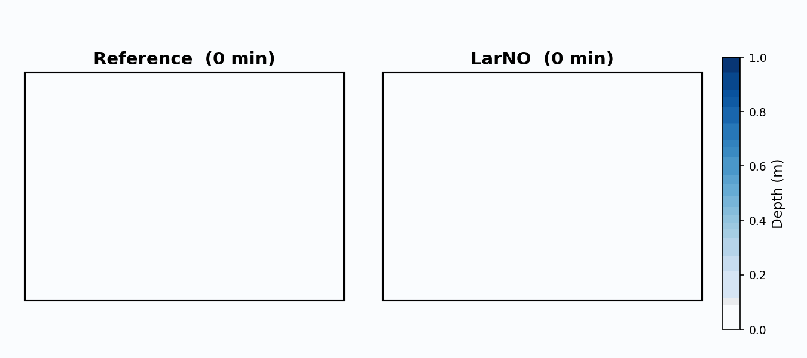
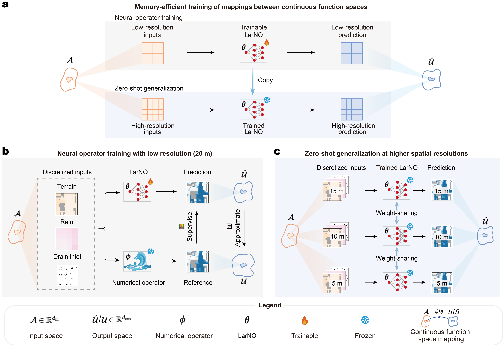
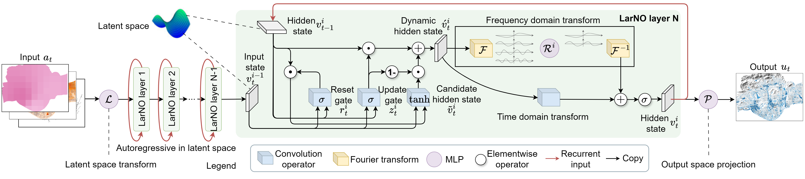

# [（Journal of Hydrology 2026）基于 LarNO 的大尺度城市洪水建模与零样本高分辨率泛化](https://doi.org/10.1016/j.jhydrol.2026.135686)

<p align="center">
  <a href="https://doi.org/10.1016/j.jhydrol.2026.135686"></a>
  <a href="https://holmescao.github.io/datasets/LarNO"></a>
  <a href="https://colab.research.google.com/drive/1I9TDBCC0rQU3dKMujRCCm8hRMSumGe7E"></a>
  <a href="https://github.com/holmescao/U-RNN"></a>
</p>

<p align="center"><a href="README.md">English</a> | <strong>中文</strong></p>

---

<p align="center">
  
  <br><em><strong>LarNO 与 MIKE+ 参考的对比 — 水深动态对比（5 分钟步长，6 小时洪水事件，深圳福田区，~100 km²）。</strong>左：MIKE+ 水力求解器（参考）。右：LarNO 预测。LarNO 的推理比 MIKE+ 快约 940 倍，并达到毫米级水深精度（20 m 分辨率，已发布数据集）。</em>
</p>

**LarNO** 使用 **潜在自回归神经算子** 对大尺度城市洪水进行建模 — 在数百万网格单元（~100 km²）上预测水深图，达到 **O(mm) 级精度**，并比 MIKE+ 水力求解器 **快约 940 倍**。模型在低分辨率上训练，可 **零样本泛化到更高分辨率**（如 8 m → 2 m、20 m → 5 m）而无需重新训练，并可通过少样本微调迁移到未见过的汇水区。

> 🧪 **想立即试用 LarNO —— 无需安装？**
> 打开我们的 **[Google Colab notebook](https://colab.research.google.com/drive/1I9TDBCC0rQU3dKMujRCCm8hRMSumGe7E)**，在浏览器中用预训练权重对 Futian 洪水数据集运行推理，约 15 分钟即可完成。
>
> 📚 **想复现论文？** 完整的分步教程位于 **[`tutorials/`](tutorials/README.md)**（英文 & 中文）。

## 亮点

- LarNO 提出了一种潜在自回归神经算子，用于城市洪水建模中的 **零样本**、**高分辨率时空泛化**。
- 潜在自回归改善了对非线性时空洪水动力学的表征。
- LarNO 可在 **数百万网格单元**（~100 km2）和 **接近十亿级时空点**（5 m、5 min 分辨率）上进行大尺度洪水预报。
- LarNO 达到 **O(mm) 级水深精度**。
- LarNO 支持通过 **微调** 进行 **少样本迁移** 到未见过的汇水区。
- LarNO 支持 **多 GPU 分布式训练** 和 **TensorRT 加速推理**。

## 新闻

- **[15/05/2026]** 🎉🎉🎉[LarNO](https://doi.org/10.1016/j.jhydrol.2026.135686) 已在 **Journal of Hydrology** 在线发表！
- **[12/03/2026]** 预训练权重与基准数据集已发布在 **[HuggingFace](https://huggingface.co/holmescao/LarNO)** —— 无需 Google Drive 或百度网盘即可下载。
- **[12/03/2026]** 交互式 demo 发布 —— 用 **[Google Colab](https://colab.research.google.com/drive/1I9TDBCC0rQU3dKMujRCCm8hRMSumGe7E)** 在浏览器中运行 LarNO 推理，无需安装。
- **[02/03/2026]** 完整的端到端复现教程发布 —— 用 **[AutoDL](https://www.autodl.com/) 上的单卡 GPU** 训练和测试 LarNO。
- **[02/03/2026]** 代码已在 **[GitHub](https://github.com/holmescao/LarNO)** 发布，基准 **[数据集](https://holmescao.github.io/datasets/LarNO)** 已公开发布。

---

<p align="center">
  
  <br><em><strong>面向城市洪水时空预报的内存高效神经算子训练与零样本高分辨率泛化。</strong>
    (a) 概览：神经算子在低分辨率上训练，并通过在更细网格上直接评估所学连续算子，零样本应用于更高分辨率。
    (b) 训练阶段：离散化输入（降雨、地形、雨水口）输入神经算子，输出由数值求解器（MIKE Plus）监督。
    (c) 在更高空间分辨率上零样本应用已训练算子，无需任何重新训练。</em>
</p>

<p align="center">
  
  <br><em><strong>面向城市洪水时空预报的 LarNO 架构。</strong>
    模型包含三个阶段：(1) 提升层将输入映射到更高维的隐藏状态；(2) N 个 LarNO 层迭代更新隐藏状态 —— 每层先应用基于 GRU 的卷积更新（结合上一时间步和上一层的隐藏状态），再通过频域傅里叶变换（正向 FFT、低模线性混合、逆 FFT）和局部时域线性算子细化状态；(3) 投影层将最终隐藏状态映射到输出水深。</em>
</p>

## 快速开始

<div align="center">

| | |
|:---:|:---|
| [](https://colab.research.google.com/drive/1I9TDBCC0rQU3dKMujRCCm8hRMSumGe7E) | **没有本地 GPU？在浏览器中试用。** Colab notebook 用预训练权重对 Futian 数据集运行推理，约 15 分钟 —— 无需安装、无需下载数据集。 |

</div>

或在本地用 **3 步** 运行（完整步骤见 [教程](tutorials/README.md)）：

```bash
# 1. 克隆并安装（详见 tutorials/zh/01-installation.md）
git clone https://github.com/holmescao/LarNO && cd LarNO/code/urbanflood_larfno
pip install -e . && pip install -r requirements.txt

# 2. 下载数据集（tutorials/zh/02）和预训练权重（tutorials/zh/03），然后：

# 3. 运行推理 —— 结果在 exp/<timestamp>/
python test.py --config urbanflood_config_2d.yaml --expr_id 20260220_183648_006352
```

## 性能

### Futian 基准

在 Futian 区（~100 km²，深圳）基准上的对比 —— **5 m 分辨率，零样本超分辨率**（在 20 m 上训练，在 5 m 上测试）。结果来自论文表 1。

| 方法                     | 参数量     | 推理†      | 相对 MIKE+ 加速 | MAE (m) ↓         | CSI ↑             |
| ------------------------ | ---------- | ---------- | --------------- | ----------------- | ----------------- |
| MIKE+（水力求解器）      | —          | ~8.9 h     | 1×              | 参考              | 参考              |
| UNO                      | 109.1 M    | 45 s       | ~710×           | 0.024 ± 0.007     | 0.343 ± 0.026     |
| FNO                      | 29.1 M     | 42 s       | ~760×           | 0.019 ± 0.004     | 0.620 ± 0.027     |
| **LarNO（本文）**        | **29.1 M** | **34 s** ‡ | **~940×**       | **0.008 ± 0.003** | **0.722 ± 0.016** |

> † 单个 6 小时洪水事件在 NVIDIA RTX 4090 上的推理时间。
> ‡ LarNO 推理使用 **TensorRT (TRT)** 加速；UNO 和 FNO 不支持 TRT。
> **注意：** 为便于获取，已发布数据集为 **20 m 降采样版本**。在已发布的 20 m 数据上的指标会与上述 5 m 论文结果不同。

### UKEA 基准（已发布数据集）

LarNO 从 Futian 预训练权重在一个未见过的区域上微调（UKEA 小案例，`ukea_8m_5min`，8 个训练事件，100 个 epoch）。在 12 个测试事件上评估。

| 分辨率   | 设置                            | R² ↑              | MAE (m) ↓           | CSI ↑             | PeakR² ↑      |
| -------- | ------------------------------- | ----------------- | ------------------- | ----------------- | ------------- |
| **8 m**  | 微调（训练分辨率）              | 0.948 ± 0.056     | 0.0093 ± 0.0074     | 0.741 ± 0.030     | 0.949 ± 0.049 |
| **2 m**  | 零样本超分辨率（4×）            | 0.776 ± 0.129     | 0.0163 ± 0.0101     | 0.515 ± 0.052     | 0.820 ± 0.101 |

> 零样本 2 m 结果使用在 8 m 上训练的模型 —— 训练期间未见过任何 2 m 数据。

## 📚 文档

完整的复现教程位于 **[`tutorials/`](tutorials/README.md)** —— 提供 **英文** 和 **中文** 两个版本。推荐顺序：环境准备（1 → 3）→ 推理（4）→ 训练（5）。

| 我想… | 指南 |
|---|---|
| 安装环境 | [1. 安装](tutorials/zh/01-installation.md) |
| 获取数据集 | [2. 数据集准备](tutorials/zh/02-datasets.md) |
| 获取预训练权重 | [3. 预训练权重](tutorials/zh/03-pretrained-weights.md) |
| 运行推理并解读输出 | [4. 推理、评估与输出](tutorials/zh/04-inference.md) |
| 训练（微调 / 从头） | [5. 训练](tutorials/zh/05-training.md) |
| 使用租用的云 GPU | [6. 云 GPU — AutoDL](tutorials/zh/06-cloud-gpu-autodl.md) |
| 查阅配置、布局与输出 | [7. 参考](tutorials/zh/07-reference.md) |
| 故障排查 | [8. 常见问题](tutorials/zh/08-faq.md) |

## 许可

本项目基于 [MIT License](LICENSE) 发布。

## 引用

如果你在研究中使用了 LarNO，请引用 Journal of Hydrology 论文（DOI：[10.1016/j.jhydrol.2026.135686](https://doi.org/10.1016/j.jhydrol.2026.135686)）：

```bibtex
@article{cao2026large,
  title={Large-scale urban flood modeling and zero-shot high-resolution generalization with LarNO},
  author={Cao, Xiaoyan and Yao, Yao and Wang, Zhi and Zhao, Zhangxinyue and Borthwick, Alistair GL and Qin, Huapeng},
  journal={Journal of Hydrology},
  pages={135686},
  year={2026},
  doi={10.1016/j.jhydrol.2026.135686},
  publisher={Elsevier}
}
```

如果你使用了已发布的基准数据集，请同时引用：

```bibtex
@article{cao2025bench,
author = {Cao, Xiaoyan and Qin, Huapeng},
title = {Benchmark dataset of ``Large-scale urban flood modeling and zero-shot high-resolution generalization with LarNO''},
year = {2025},
url = "https://figshare.com/articles/dataset/Benchmark_dataset_of_Large-scale_urban_flood_modeling_and_zero-shot_high-resolution_generalization_with_LarNO_/30529031",
doi = {10.6084/m9.figshare.30529031.v4}
}
```

如果你的工作涉及城市洪水的高分辨率时空临近预报，你可能也会对我们的相关工作 **[U-RNN](https://github.com/holmescao/U-RNN)** 感兴趣，它聚焦于高时空分辨率的城市洪水临近预报，发表于 *Journal of Hydrology*：

```bibtex
@article{cao2025u,
  title={U-RNN high-resolution spatiotemporal nowcasting of urban flooding},
  author={Cao, Xiaoyan and Wang, Baoying and Yao, Yao and Zhang, Lin and Xing, Yanwen and Mao, Junqi and Zhang, Runqiao and Fu, Guangtao and Borthwick, Alistair GL and Qin, Huapeng},
  journal={Journal of Hydrology},
  pages={133117},
  year={2025},
  publisher={Elsevier}
}
```
